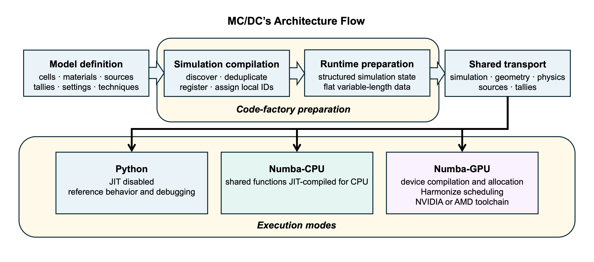

.. _architecture:

============
Architecture
============

Architecture documentation explains how MC/DC translates flexible Python model definitions into particle-transport execution:

The architecture flow follows a Monte Carlo transport model from definition through one common preparation path, then branches into the Python, Numba-CPU, or Numba-GPU execution modes.
The figure above emphasizes three major model-to-execution stages:

#. **Simulation compilation** discovers the Python objects owned by a :class:`mcdc.Simulation`, deduplicates them, and assigns simulation-local identifiers.
   :doc:`simulation_compilation` explains model ownership, discovery, and finalization.
#. **Runtime preparation** converts the compiled model into the structured ``simulation`` state and flat ``data`` array consumed by transport.
   :doc:`runtime_data_layout` explains this numerical representation and its generated access helpers, ``mcdc_get`` and ``mcdc_set``.
#. **Transport execution** runs the common, adaptable transport implementation in the selected execution mode.
   :doc:`transport_execution` explains how Python, Numba-CPU, and Numba-GPU execute it, including GPU code generation, memory placement, and Harmonize scheduling.

After transport, ``main.run_simulation`` passes the completed runtime state to ``mcdc.output`` for result aggregation and HDF5 serialization.
This final results-and-output stage completes the calculation lifecycle but remains outside the shared transport implementation shown in the figure.

Visit :doc:`python_first_numba_accelerated_design` for the rationale, boundaries, and tradeoffs that shape MC/DC's architecture.
It explains why method development begins in unrestricted Python mode and may progress through Numba-CPU to Numba-GPU.

Component Responsibility
------------------------

The source tree follows the same separation of responsibilities shown in the architecture flow.
Model-facing components define, collect, and finalize the simulation.
Code-factory components coordinate object discovery and generate its runtime representation.
Transport components implement the numerical algorithms shared by all execution modes.
Output components aggregate and serialize completed results.
For :ref:`methods development <development_areas>`, ``object_/`` and ``transport/`` form the primary extension surface.
The ``code_factory/`` package implements the framework-level compilation and generation bridge between them.
The table maps each component to its corresponding architecture role.
Paths in the component column are relative to the top-level ``mcdc/`` package.

.. list-table::
   :header-rows: 1
   :widths: 28 22 50

   * - Component
     - Architecture role
     - Responsibility
   * - ``object_/``
     - Model definition and compilation
     - Defines Python-side model classes and their object-local finalization hooks.
   * - :class:`mcdc.Simulation` in ``object_/simulation.py``
     - Model definition and control
     - Owns model roots and configuration, resolves model-wide finalization, and controls compilation, visualization, and execution.
   * - ``config.py``
     - Calculation configuration
     - Parses command-line controls, configures process-wide execution behavior, and applies supported simulation-setting overrides before compilation.
   * - ``constant.py``
     - Shared static definitions
     - Defines named numerical codes, event flags, numerical limits, and tolerances used across model, transport, and output components.
   * - ``code_factory/python_objects_compiler.py``
     - Simulation compilation
     - Coordinates recursive discovery, registration, and model-wide finalization.
   * - ``main.run_simulation``
     - Calculation orchestration
     - Coordinates runtime preparation, transport execution, result generation, runtime reporting, and backend finalization.
   * - ``print_.py``
     - Diagnostics and reporting
     - Centralizes fatal errors, master-rank messages, calculation progress, and runtime summaries used across the model, transport, and output stages.
   * - ``main.prepare``
     - Runtime preparation
     - Coordinates framework-level packing, execution-resource allocation, backend configuration, and external runtime state.
   * - ``code_factory/literals_generator.py`` and ``literals.py``
     - Runtime preparation
     - Derive and expose simulation-specific values that compiled transport requires as literals.
   * - ``code_factory/numba_layers_generator.py``
     - Runtime preparation
     - Derives structured dtypes, packs runtime state, generates accessors, and initiates GPU-specific preparation when requested.
   * - Runtime ``simulation`` and ``data``
     - Prepared runtime data
     - Store fixed-layout state and variable-length numerical data generated by ``numba_layers_generator.py``.
   * - ``mcdc_get/`` and ``mcdc_set/``
     - Runtime data access
     - Provide generated access to variable-length fields stored in ``data``.
   * - ``transport/``
     - Shared transport
     - Implements the particle-transport algorithms used by every execution mode.
   * - ``output.py``
     - Results and output
     - Aggregates completed tally results and writes settings, tallies, eigenvalue data, saved particles, and runtime measurements to HDF5.

.. rst-class:: architecture-component-followup

The ``mcdc/object_`` modules, :class:`mcdc.Simulation`, and ``python_objects_compiler.py`` implement the model-definition and simulation-compilation stages.
:doc:`simulation_compilation` explains their relationships, while :doc:`../extending/extending_the_object_model` explains how contributors can extend them.

``main.prepare``, ``numba_layers_generator.py``, runtime ``simulation`` and ``data``, and generated ``mcdc_get`` and ``mcdc_set`` implement framework-level runtime preparation and form the data boundary between model compilation and transport.
:doc:`runtime_data_layout` explains their roles.

The ``mcdc/transport`` package implements the shared-transport stage.
:doc:`transport_execution` explains how the execution modes run it.
:doc:`../extending/writing_numba_compatible_transport_code` provides practical rules for extending its algorithms.

Results and Output
------------------

After the selected transport driver returns, ``main.run_simulation`` calls ``output.generate_output`` with the prepared ``simulation`` record, flat ``data`` array, and Python :class:`mcdc.Simulation`.
``output.py`` reads fixed fields directly, uses ``mcdc_get`` for variable-length runtime data, and retains Python-side settings and names where they form part of the output schema.

The module writes the primary HDF5 file, serializes tally and eigenvalue results, optionally saves particles, recombines census-based tally files, and appends runtime measurements.
It may reshape or aggregate finalized results for storage, but particle tracking and tally scoring remain responsibilities of ``transport/``.

When a new result must persist after a run, define and prepare its runtime storage first, populate it during the appropriate transport or closeout stage, and add only the serialization step to ``output.py``.
Changes to the user-visible HDF5 structure should also update the corresponding user documentation, regression coverage, and ``CHANGELOG.md`` entry.

Utility Module Scope
--------------------

``util`` denotes helpers shared within the package that contains the module.
The complete import path therefore defines the helper's architectural scope.

.. list-table::
   :header-rows: 1
   :widths: 34 66

   * - Module
     - Scope
   * - ``util.py``
     - Contains framework-neutral helpers shared across top-level MC/DC packages, currently the nested-list ``flatten`` operation.
   * - ``object_/util.py``
     - Supports Python model construction and finalization, including distribution conversion, validation, motion processing, and model-side reference data.
   * - ``transport/util.py``
     - Provides Numba-compatible helpers shared across transport domains, including binning, interpolation, atomic updates, local arrays, and backend-neutral simulation access.
   * - ``transport/physics/util.py``
     - Contains numerical helpers shared specifically by neutron and electron physics implementations.
   * - ``code_factory/gpu/transport/util.py``
     - Implements GPU-compatible replacements and compiler lowering for the adaptable operations exposed by ``transport/util.py``.

Place a new helper in the narrowest package that contains all of its consumers.
Model-construction helpers may use ordinary Python and NumPy behavior, while helpers reachable from ``transport/`` must follow the compiled-execution constraints described in :doc:`../extending/writing_numba_compatible_transport_code`.
Hardware-specific replacements belong in the corresponding backend adaptation.
Promote a helper to a broader ``util.py`` only when multiple sibling components genuinely share it, and avoid treating any utility module as a collection for otherwise unrelated code.

.. toctree::
   :maxdepth: 1
   :hidden:

   python_first_numba_accelerated_design
   simulation_compilation
   runtime_data_layout
   transport_execution
