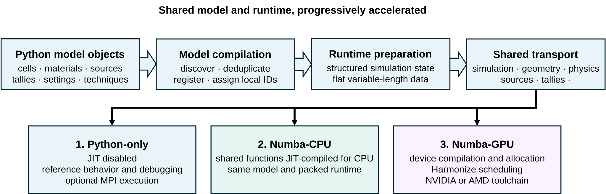

.. _architecture:

============
Architecture
============

Architecture documentation explains how MC/DC translates flexible Python model definitions into particle-transport execution:

The architecture flow follows a Monte Carlo transport model from definition through one common preparation path, then branches into the Python, Numba-CPU, or Numba-GPU execution modes.
The flow has three major processing stages:

#. **Simulation compilation** discovers the Python objects owned by a :class:`mcdc.Simulation`, deduplicates them, and assigns simulation-local identifiers.
   :doc:`simulation_compilation` explains model ownership, discovery, and finalization.
#. **Runtime preparation** converts the compiled model into the structured ``simulation`` state and flat ``data`` array consumed by transport.
   :doc:`runtime_data_layout` explains this numerical representation and its generated access helpers.
#. **Transport execution** runs the common, adaptable transport implementation in the selected execution mode.
   :doc:`python_numba_cpu_execution` describes Python and Numba-CPU execution, while :doc:`numba_gpu_execution` continues into GPU code generation, memory placement, and Harmonize scheduling.

Visit :doc:`python_first_numba_accelerated_design` for the rationale, boundaries, and tradeoffs that shape MC/DC's architecture.
It explains why method development begins in unrestricted Python mode and may progress through Numba-CPU to Numba-GPU.

Component Responsibility
------------------------

The source tree follows the same separation of responsibilities. Model-facing
components define and collect the simulation, generated-data components prepare
the representation used during transport, and transport components implement
the numerical algorithms shared by the execution backends. The middle column
of the table below maps each component to the corresponding role in the architecture flow shown in the figure
above. Paths in the component column are relative to the top-level ``mcdc/``
package.

.. list-table::
   :header-rows: 1
   :widths: 28 22 50

   * - Component
     - Architecture role
     - Responsibility
   * - ``object_/``
     - Model definition
     - Defines the Python-side model, configuration, and runtime-state classes.
   * - :class:`mcdc.Simulation` in ``object_/simulation.py``
     - Model definition and control
     - Owns model roots and configuration and controls compilation,
       visualization, and execution.
   * - ``code_factory/python_objects_compiler.py``
     - Simulation compilation
     - Discovers and registers the connected Python object graph.
   * - ``code_factory/numba_layers_generator.py``
     - Runtime preparation
     - Derives structured dtypes, packs runtime state, generates accessors, and
       initiates GPU-specific preparation when requested.
   * - Runtime ``simulation`` and ``data``
     - Prepared transport data
     - Generated by ``numba_layers_generator.py``; store fixed-layout state and
       variable-length numerical data,
       respectively.
   * - ``mcdc_get/`` and ``mcdc_set/``
     - Transport data access
     - Generated by ``numba_layers_generator.py``; provide structured access to
       fields stored in ``data``.
   * - ``transport/``
     - Shared transport
     - Implements the particle-transport algorithms consumed by every
       execution backend.

.. rst-class:: architecture-component-followup

The ``mcdc/object_`` modules, :class:`mcdc.Simulation`, and
``python_objects_compiler.py`` form the Python model and compilation side (the
first two boxes) of the architecture flow. Their relationships are discussed in
:doc:`simulation_compilation`; contributors changing them should also read
:doc:`../extending/extending_the_object_model`.

The ``numba_layers_generator.py``, runtime ``simulation`` and ``data``, and
generated access modules (``mcdc_get`` and ``mcdc_set``) form the data boundary
between model construction and transport, implementing the runtime-preparation box.
Their roles are discussed in :doc:`runtime_data_layout`. Finally, ``mcdc/transport``
corresponds to the shared-transport box, while :doc:`python_numba_cpu_execution` and
:doc:`numba_gpu_execution` explain the lower execution branches. Practical
rules for extending the transport algorithms are collected in
:doc:`../extending/writing_numba_compatible_transport_code`.

.. toctree::
   :maxdepth: 1
   :hidden:

   python_first_numba_accelerated_design
   simulation_compilation
   runtime_data_layout
   python_numba_cpu_execution
   numba_gpu_execution
