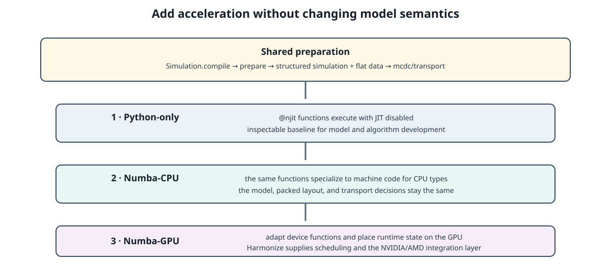

.. _python_numba_cpu_execution:

==============================
Python and Numba-CPU Execution
==============================

MC/DC uses one transport implementation for both Python and Numba-CPU
execution. The Python path is the conceptual baseline: it is the easiest mode
to inspect and debug, and it establishes the behavior that the accelerated
path preserves.

Both modes operate on the same packed :doc:`runtime_data_layout` and call the
same functions under ``mcdc/transport``. The difference is whether Numba
executes functions decorated with ``@njit`` as ordinary Python functions or
compiles them for the CPU.

Shared Preparation
------------------

Before transport begins, both modes follow the same preparation path:

#. :class:`mcdc.Simulation` compiles the reachable Python object graph.
#. ``mcdc.main.prepare`` derives run-dependent values such as particle-bank
   sizes and physics-mode selections.
#. ``mcdc.code_factory`` builds the structured ``simulation`` state and flat
   ``data`` array.
#. Generated ``mcdc_get`` and ``mcdc_set`` helpers provide transport-safe
   access to variable-length fields.
#. The fixed-source or k-eigenvalue driver calls the transport kernels.

This shared preparation is why Python mode can expose the same data-layout and
transport behavior as Numba mode without maintaining a separate reference
implementation.

Python Mode
-----------

Python mode is the default:

.. code-block:: sh

   python input.py --mode=python

In this mode, MC/DC sets ``numba.config.DISABLE_JIT``. Functions decorated with
``@njit`` therefore execute through Python while retaining the same signatures
and packed runtime inputs used by accelerated execution.

Python mode is best for:

- Prototyping, developing, and inspecting transport logic.
- Checking model construction and object compilation.
- Obtaining ordinary Python tracebacks.
- Running small smoke tests before enabling acceleration.

Python mode does not bypass simulation compilation or runtime packing. It
bypasses machine-code generation for the CPU transport functions.

Python Prototyping
^^^^^^^^^^^^^^^^^^

The standard MC/DC Python execution path is also the environment for initial
methods development. A prototype remains a complete MC/DC calculation and
does not bypass model compilation, runtime preparation, or transport. Because
JIT compilation is disabled, its transport code may temporarily access
arbitrary Python objects or global state, import external packages, perform I/O
or visualization, and use hard-coded or dynamic behavior.

These freedoms do not form a separate execution architecture. Advancing the
method to Numba-CPU requires adapting the parts used by accelerated transport
to the packed runtime representation and compiler-compatible interfaces.

Before Numba Acceleration
-------------------------

At the transition from an MC/DC-Python-only method to Numba acceleration,
:doc:`python_first_numba_accelerated_design` is the main conceptual guide. It
explains why MC/DC converts its flexible Python model into typed runtime data,
which parts remain shared across execution backends, and which constraints
follow from supporting Numba-CPU and Numba-GPU.

If you have not already read that design page as an overview, read it before
continuing when developing MC/DC or studying its acceleration architecture.
Readers who only need the mechanics of the Python and Numba-CPU modes may
continue directly below.

Numba-CPU Mode
--------------

Numba-CPU mode enables just-in-time compilation:

.. code-block:: sh

   python input.py --mode=numba

The target defaults to ``cpu``. Numba specializes the shared transport
functions for the structured simulation dtype, flat data array, particle
records, and other argument types encountered during execution. The initial
run therefore includes compilation work; subsequent transport work uses the
compiled functions.

The runtime representation is unchanged:

.. list-table::
   :header-rows: 1
   :widths: 24 38 38

   * - Concern
     - Python mode
     - Numba-CPU mode
   * - Model ownership
     - Explicit ``Simulation``
     - Explicit ``Simulation``
   * - Object-graph compilation
     - Required
     - Required
   * - Packed ``simulation`` and ``data``
     - Required
     - Required
   * - Transport implementation
     - ``mcdc/transport``
     - ``mcdc/transport``
   * - ``@njit`` behavior
     - JIT disabled
     - Compiled for CPU

Numba debug mode keeps JIT compilation enabled while adding bounds checking,
fuller tracebacks, and compiler diagnostics:

.. code-block:: sh

   python input.py --mode=numba_debug

Use the ordinary Python mode first to separate model or algorithm errors from
Numba typing and compilation errors. For operational commands, MPI execution,
and caching options, see :doc:`../../user_guide/execution/cpu`. For coding
rules and a staged verification workflow, see
:doc:`../extending/writing_numba_compatible_transport_code`.

From CPU to GPU
---------------

Numba-GPU execution retains the same Python model-compilation and runtime-layout
concepts, then replaces the CPU execution backend with device compilation and
Harmonize scheduling. Continue with :doc:`numba_gpu_execution` after the
Python and Numba-CPU paths are clear.
