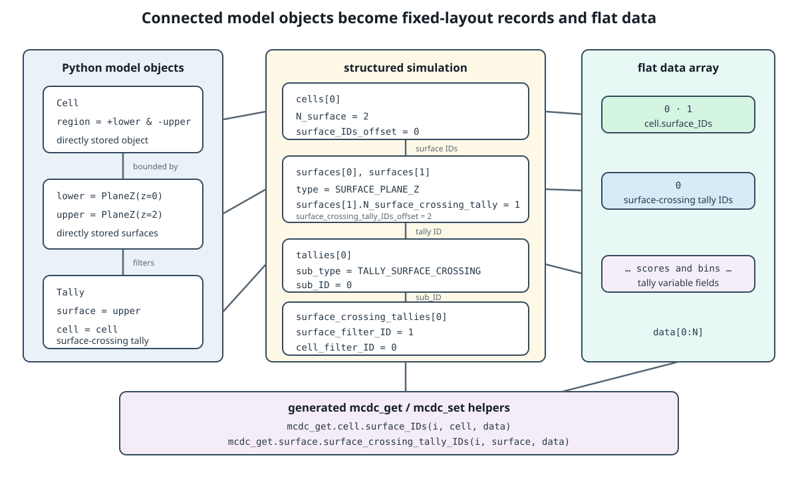

.. _runtime_data_layout:

===================
Runtime Data Layout
===================

After model compilation has discovered and ordered the Python object graph,
``mcdc.main.prepare`` creates the runtime representation used by transport.
The representation has two complementary parts:

``simulation``
   A fixed-layout NumPy structured record containing scalar state, embedded
   records, typed object collections, fixed-size arrays, and metadata.

``data``
   A contiguous one-dimensional NumPy array containing variable-length
   numerical payloads and lists of object IDs.

The same logical representation is used by Python, Numba-CPU, and Numba-GPU
execution. It should therefore be understood as MC/DC's transport runtime
model, not as a separate Numba-only model.

Why Two Structures?
-------------------

Python model objects may contain arrays whose sizes depend on the problem:
energy grids, cross sections, mesh boundaries, motion tables, tally filters,
and many others. Nested Python references and arbitrary array shapes cannot be
embedded directly in a stable structured dtype.

MC/DC separates fixed-layout metadata from variable-length values:

For a variable-length field such as ``mesh.z``, the mesh record stores values
equivalent to:

.. code-block:: text

   z_offset = 120
   z_length = 61

and the values occupy:

.. code-block:: text

   data[120:181]

For multidimensional arrays, annotated shape metadata supplies the strides used
to reconstruct logical indexing. The payload itself is flattened when packed.

Deriving the Layout
-------------------

Classes in ``mcdc/object_`` declare their runtime-visible fields with Python
type annotations. ``generate_numba_layers`` collects those annotations and
maps them to runtime fields:

- Scalars become scalar structured fields.
- Fixed-shape annotated arrays are embedded in structured records.
- Variable-length arrays become ``<field>_offset`` and ``<field>_length``
  metadata plus values in ``data``.
- Object references become ``<field>_ID`` fields.
- Lists of object references become ``N_<object>`` and
  ``<object>_IDs_offset`` metadata plus IDs in ``data``.
- Members named in a class's ``non_numba`` list are excluded from the packed
  representation or handled specially.

Polymorphic base and subtype collections receive separate structured dtypes.
The base ``ID``, ``sub_type``, ``sub_ID``, and child ``base_ID`` fields connect
those collections without Python references.

Packing is performed in two passes:

#. Walk the compiled objects to build records and calculate the required
   ``data`` size.
#. Allocate ``data`` and walk the objects again to copy flattened payloads into
   their assigned regions.

The structured ``simulation`` dtype can then be finalized because collection
sizes, particle-bank sizes, and nested record types are known.

The One-element Container
-------------------------

The generated simulation record is stored in a one-element NumPy array:

.. code-block:: python

   simulation_container, data = prepare(simulation_python)
   simulation = simulation_container[0]

The container gives Python, Numba, MPI, and GPU paths a consistent mutable
reference to the structured state. Transport drivers receive the container and
``data``; individual kernels generally operate on the record or its nested
objects.

Generated Access Helpers
------------------------

``mcdc.code_factory`` generates modules under ``mcdc/mcdc_get`` and
``mcdc/mcdc_set`` for variable-length fields. These helpers hide offset and
stride arithmetic from transport code and remain callable from both Python and
Numba-compiled functions.

Conceptually, a generated element getter performs:

.. code-block:: python

   def z(index, mesh, data):
       offset = mesh["z_offset"]
       return data[offset + index]

Generated helpers also provide operations for complete arrays, final elements,
chunks, vectors, and multidimensional elements as appropriate. Transport code
can therefore express logical access such as:

.. code-block:: python

   boundary = mcdc_get.structured_mesh.z(index, mesh, data)

without depending on where that mesh's z-grid happens to reside in ``data``.

Transport Consumption
---------------------

Modules under ``mcdc/transport`` consume only the runtime representation and
primitive transport records. They use:

- Direct structured-field access for fixed-size values and metadata.
- Base and subtype IDs to navigate registered objects.
- ``mcdc_get`` and ``mcdc_set`` for variable-length values.
- The same function signatures in Python and Numba-CPU modes.

The layout is fixed for the duration of a prepared run. Transport may update
allocated values, tally bins, particle banks, and runtime counters, but it
cannot resize a field or introduce a new model object. Changing the model
requires a new model compilation and runtime-preparation pass.

Execution Backends
------------------

Continue with :doc:`python_numba_cpu_execution` to see how Python mode and
Numba-CPU mode consume this shared layout. GPU allocation and Harmonize
integration are described in :doc:`numba_gpu_execution`.
