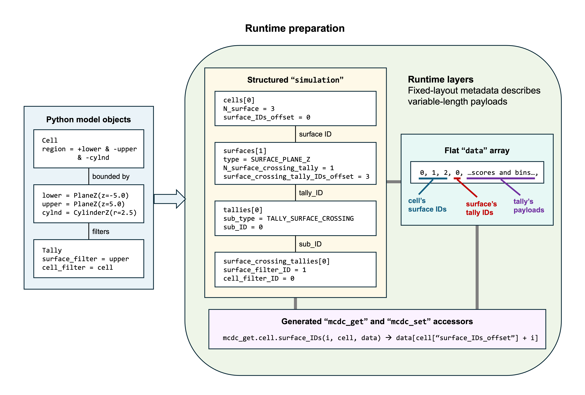

.. _runtime_data_layout:

===================
Runtime Data Layout
===================

After model compilation has discovered and ordered the Python object graph, ``mcdc.main.prepare`` creates the runtime representation used by transport.
The representation has two complementary parts:

``simulation``
   A fixed-layout NumPy structured record containing scalar state, embedded records, typed object collections, fixed-size arrays, and metadata.

``data``
   A contiguous one-dimensional NumPy array containing variable-length numerical payloads and lists of object IDs.

The same logical representation is supplied to Python, Numba-CPU, and Numba-GPU execution.
It should therefore be understood as MC/DC's transport runtime model, not as a separate Numba-only model.
During Python-only prototyping, transport code may also access arbitrary Python state alongside this representation.
A method intended for portable, maintained execution must express the state required by transport through the prepared representation.
See :doc:`python_first_numba_accelerated_design` for this development model.

Why Two Structures?
-------------------

Python model objects may contain arrays whose sizes depend on the problem: energy grids, cross sections, mesh boundaries, motion tables, tally filters, and many others.
Nested Python references and arbitrary array shapes cannot be embedded directly in a stable structured dtype.

MC/DC separates fixed-layout metadata from variable-length values:

An Explicit Runtime Object Model
^^^^^^^^^^^^^^^^^^^^^^^^^^^^^^^^

At a high level, MC/DC's prepared representation recreates machinery that an object system normally provides behind a class interface.
A conventional object runtime stores fixed fields with the object while references point to separately allocated objects and variable-length values.
Accessing an attribute follows those references without requiring application code to know where the referenced memory resides.

MC/DC makes comparable operations explicit.
Fixed fields become structured-record fields, Python object references become simulation-local IDs, variable-length fields become offsets into ``data``, and generated accessors perform the corresponding lookup or offset calculation.
The combination of ``simulation`` and ``data`` can therefore be understood as a purpose-built runtime object model backed by explicit records and a flat data arena.

Seen narrowly, this design reinvents facilities already supplied by Python and other language runtimes.
MC/DC derives schemas, assigns object identities, packs values, represents relationships, dispatches among concrete representations, and generates field accessors.
Maintaining this machinery adds implementation complexity and requires MC/DC to define rules that an ordinary class system would otherwise manage automatically.

The duplication is necessary because the Python object model does not satisfy MC/DC's execution requirements.
Python objects may contain interpreter-managed references, dynamic types, arbitrary inheritance behavior, and separately allocated containers that Numba cannot generally compile or transfer to an accelerator.
Host pointers also cannot serve as portable references to state allocated in a GPU address space.
MC/DC instead needs a complete representation with predictable types, explicit ownership, stable relationships, and equivalent access patterns across Python, Numba-CPU, and Numba-GPU execution.

The current single ``float64`` data arena is a simplifying choice within this design rather than an inherent requirement of an explicit runtime object model.
It gives MC/DC one variable-length allocation, one offset space, and consistent function signatures across execution modes.
Integer values stored in the arena, including lists of object IDs, are exactly representable for practical MC/DC model sizes but must be cast back to integers when accessed.
Separate typed arenas could preserve integer types and avoid those conversions, but would introduce additional allocations, offsets, generated accessors, function arguments, and GPU memory management.

MC/DC's implementation should therefore be viewed neither as an ordinary Python class layout nor as a general-purpose replacement for one.
It is a specialized, arena-backed object model that exchanges language-level generality for the predictable representation required by portable particle-transport execution.

Object Collections
^^^^^^^^^^^^^^^^^^

Registered model objects are stored in collections on ``simulation``.
The figure follows a cell, its boundary surfaces, and a surface-crossing tally.
It demonstrates both forms of runtime collection.

For a non-polymorphic category, an object's simulation-local ID directly indexes its collection.
A particle's current cell and one of its boundary surfaces are therefore retrieved with:

.. code-block:: python

   cell = simulation["cells"][particle["cell_ID"]]
   surface_ID = int(mcdc_get.cell.surface_IDs(0, cell, data))
   surface = simulation["surfaces"][surface_ID]

A polymorphic category has both a common base collection and a collection for each concrete representation.
A surface stores the IDs of the surface-crossing tallies attached to it.
Each ID first selects a base tally record, whose ``sub_type`` and ``sub_ID`` identify the concrete surface-crossing record:

.. code-block:: python

   from mcdc.constant import TALLY_SURFACE_CROSSING

   tally_ID = int(
       mcdc_get.surface.surface_crossing_tally_IDs(0, surface, data)
   )
   tally = simulation["tallies"][tally_ID]

   if tally["sub_type"] == TALLY_SURFACE_CROSSING:
       surface_crossing_tally = simulation["surface_crossing_tallies"][
           tally["sub_ID"]
       ]

The concrete tally record retains ``surface_filter_ID`` and ``cell_filter_ID``, connecting it back to the selected surface and cell.
All IDs are assigned during model compilation and identify objects only within the current simulation snapshot.
The hierarchy and ID assignment are described in :doc:`simulation_compilation`.

Variable-Length Fields
^^^^^^^^^^^^^^^^^^^^^^

For a variable-length list such as a cell's boundary surfaces, the cell record stores values equivalent to:

.. code-block:: text

   surface_IDs_offset = 120
   N_surface = 2

and the two surface IDs occupy:

.. code-block:: text

   data[120:122]

For multidimensional arrays, annotated shape metadata supplies the strides used to reconstruct logical indexing.
The payload itself is flattened when packed.

Deriving the Layout
-------------------

Classes in ``mcdc/object_`` declare their runtime-visible fields with Python type annotations.
``generate_numba_layers`` collects those annotations and maps them to runtime fields:

- Scalars become scalar structured fields.
- Fixed-shape annotated arrays are embedded in structured records.
- Variable-length arrays become ``<field>_offset`` and ``<field>_length`` metadata plus values in ``data``.
- Object references become ``<field>_ID`` fields.
- Lists of object references become ``N_<object>`` and ``<object>_IDs_offset`` metadata plus IDs in ``data``.
- Members named in a class's ``non_numba`` list are excluded from the packed representation or handled specially.

Packing is performed in two passes:

#. Walk the compiled objects to build records and calculate the required ``data`` size.
#. Allocate ``data`` and walk the objects again to copy flattened payloads into their assigned regions.

The structured ``simulation`` dtype can then be finalized because collection sizes, particle-bank sizes, and nested record types are known.

The One-element Container
-------------------------

The generated simulation record is stored in a one-element NumPy array:

.. code-block:: python

   simulation_container, data = prepare(simulation_python)
   simulation = simulation_container[0]

The container gives Python, Numba, MPI, and GPU paths a consistent mutable reference to the structured state.
Transport drivers receive the container and ``data``; individual kernels generally operate on the record or its nested objects.

Generated Access Helpers
------------------------

``mcdc.code_factory`` generates modules under ``mcdc/mcdc_get`` and ``mcdc/mcdc_set`` for variable-length fields.
These helpers hide offset and stride arithmetic from transport code and remain callable from both Python and Numba-compiled functions.

Conceptually, a generated element getter performs:

.. code-block:: python

   def surface_IDs(index, cell, data):
       offset = cell["surface_IDs_offset"]
       return data[offset + index]

Generated helpers also provide operations for complete arrays, final elements, chunks, vectors, and multidimensional elements as appropriate.
Transport code can therefore express logical access such as:

.. code-block:: python

   surface_ID = int(mcdc_get.cell.surface_IDs(index, cell, data))

without depending on where that cell's surface IDs happen to reside in ``data``.

Transport Consumption
---------------------

Portable transport functions shared across the execution backends consume the runtime representation and primitive transport records.
They use:

- Direct structured-field access for fixed-size values and metadata.
- Base and subtype IDs to navigate registered objects.
- ``mcdc_get`` and ``mcdc_set`` for variable-length values.
- The same function signatures in Python and Numba-CPU modes.

The layout is fixed for the duration of a prepared run.
Transport may update allocated values, tally bins, particle banks, and runtime counters, but it cannot resize a field or introduce a new model object.
A Python-only prototype may temporarily read or modify external Python state, but that state is not part of the portable runtime layout.
Changing the prepared MC/DC model requires a new model compilation and runtime preparation pass.

Execution Backends
------------------

Continue with :doc:`python_numba_cpu_execution` to see how Python mode and Numba-CPU mode consume this shared layout.
GPU allocation and Harmonize integration are described in :doc:`numba_gpu_execution`.
