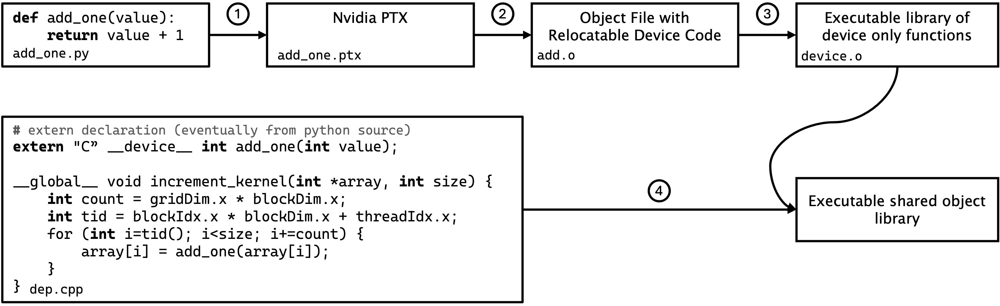
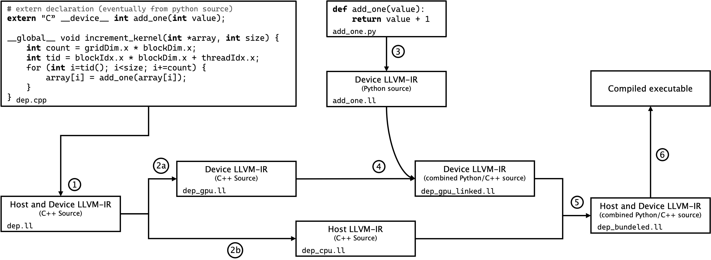

.. _transport_execution:

===================
Transport Execution
===================

MC/DC uses one adaptable transport implementation with the runtime representation described in :doc:`runtime_data_layout`.
The selected execution mode determines how that implementation runs after the common model-preparation stages.
See :doc:`python_first_numba_accelerated_design` for the rationale behind this design.

Execution Modes
---------------

In **Python mode**, MC/DC disables Numba just-in-time (JIT) compilation, and functions decorated with ``@njit`` execute as ordinary Python functions.
This mode provides the most inspectable execution of the shared transport implementation.

In **Numba-CPU mode**, Numba specializes those transport functions for the prepared runtime types and compiles them into machine code for the host CPU.
The first call includes compilation work, while subsequent calls use the compiled functions.

In **Numba-GPU mode**, MC/DC adapts the transport functions for device execution, places runtime state in GPU-accessible memory, and uses Harmonize to schedule particle work.
The remaining sections describe this additional GPU-specific compilation machinery.

Use :doc:`../extending/writing_numba_compatible_transport_code` for contributor constraints, porting guidance, and staged verification.
Use the :doc:`../../user_guide/execution/index` for operational commands.

GPU Compilation
---------------

When targeting GPUs, MC/DC functions are just-in-time (JIT) compiled with Numba and integrated with Harmonize.

Together, MC/DC, Numba, and Harmonize form a JIT portability framework that dynamically targets different hardware architectures.
This framework combines hardware portability with high-level Python methods development for exascale systems.

MC/DC transport functions become device functions, while Harmonize supplies the associated global, host, and additional device functions.
Linking device code generated from Python with the C++ Harmonize runtime requires an exact set of compiler options.
The NVIDIA and AMD proxy examples below demonstrate this process with a Python integer-addition function representing MC/DC transport and a C++ declaration and global function representing Harmonize.
Supporting functions in ``dep.cpp`` and ``add_one.py`` are omitted from the illustrations.

--------------
Nvidia Targets
--------------

MC/DC uses Numba to produce PTX and the NVIDIA CUDA compiler (``nvcc``) for NVIDIA device compilation and linking.
Current versions of Numba come with CUDA operability natively, but this is set to be deprecated in future releases in favor of a more modular approach where the Numba-CUDA package will be an optional separate feature.

         In this simplified proxy, the Python function corresponds to MC/DC, and the C++ code corresponds to Harmonize.

Simple proxy example describing how to compile device functions in Numba-Python with external C++ code for targeting Nvidia GPUs.
In this simplified proxy, the Python function corresponds to MC/DC, and the C++ code corresponds to Harmonize

The NVIDIA compilation sequence is:

#. Compiling Python device code to Nvidia PTX by ``numba.cuda.compile_ptx_for_current_device`` (which requires typed function signatures), then place that output into ``add_one.ptx`` file; next
#. Compiling PTX to relocatable device code using ``nvcc -rdc=true -dc -arch=<arch> --cudart shared --compiler-options -fPIC add.ptx -o add.o`` where ``-dc`` asks the compiler for device code, ``-rdc`` asks to make that device code relocatable, ``--cudart shared`` asks for shared CUDA runtime libraries and ``-fPIC`` generates position-independent code;
#. Compiling that relocatable byte code into a library of executable device functions is done with ``nvcc -dlink add.o -arch=<arch> --cudart shared -o device.o --compiler-options -fPIC`` where ``-dlink`` asks the compiler for relocatable device code; and finally
#. Compiling the C-CUDA file containing the global function and linking with the library of device functions originating from Python with ``nvcc -shared add.o device.o -arch=<arch> --cudart shared``.

While the complexity of the functions both from MC/DC (Python) and Harmonize (C++) increases dramatically when moving toward implementation in MC/DC, this compilation strategy remains mostly the same.
The exact compilation commands Harmonize calls when compiling MC/DC functions can be viewed by setting ``VERBOSE=True`` in ``harmonize/python/config.py``.
This compilation strategy also allows for the extension of functions defined in the CUDA API but not in Numba-CUDA as they can come from the C-CUDA source in ``dep.cpp``.

-----------
AMD Targets
-----------

Just in time compilation and execution to AMD devices are enabled as of `MC/DC v0.11.0 <https://github.com/mcdc-project/mcdc/tree/v0.11.0>`_.
Significant adaptations from the process of Nvidia compilation are required to target AMD GPUs.
PTX is a proprietary NVIDIA standard, so AMD targets use an LLVM intermediate representation (IR) generated for the selected AMD GPU target triple.
AMD's compiler toolchain is based on LLVM and Clang, and MC/DC invokes tools such as ``hipcc``, which wraps ``clang``.
Note that while the LLVM-Clang commands are generic, AMD variations of compilers, linkers, etc. must be invoked.
For example, to invoke the correct Clang compiler point to the ROCm installed variation (often on LinuxOS at ``opt/rocm/llvm/bin/clang``).

To generate AMD target LLVM-IR from Python script, a `patch to Numba is provided by AMD <https://github.com/ROCm/numba-hip>`_.
This patch can also execute produced functions from the Python interpreter, much like Numba-CUDA.
As this patch is a port of AMD's Heterogeneous-computing Interface for Portability (HIP) API, it attempts to be a one-to-one implementation of operations implemented in Numba-CUDA.
The Numba-HIP development team has gone as far as to provide a ``numba.hip.pose_as_cuda()`` function, which, after being called in Python script, will alias all supported Numba-CUDA functions to Numba-HIP ones and compile/run automatically.

Full MC/DC+Harmonize compilation combines device functions from Numba-HIP with device, global, and host functions from C++.
The AMD proxy example pairs a Numba-HIP integer-addition function with a C++ declaration and global function that applies it to an array.

Every GPU program is technically a bound set of two complementary applications: one that runs on the host side (CPU) and the other on the device side (GPU), with global functions linking them together.
Linking external device code for AMD hardware requires unbundling the host and device programs, linking the Python-generated functions into the device program, and rebundling both programs.
This process is done in LLVM-IR.

         In this simplified proxy, the Python function corresponds to MC/DC, and the C++ code corresponds to Harmonize.

Simple proxy example describing how to compile device functions in Numba-HIP with external C++ code to AMD GPU targets.
In this simplified proxy, the Python function corresponds to MC/DC, and the C++ code corresponds to Harmonize

Figure fig:codeclang shows the compilation structure.
The AMD compilation sequence is:

#. Compiling C++ source in ``dep.cpp`` to LLVM-IR with host and device code bundled together with ``hipcc -c -fgpu-rdc -S -emit-llvm -o dep.ll -x hip dep.cpp -g`` where ``-fgpu-rdc`` asks the compiler for relocatable device code ``-emit-llvm`` requests the LLVM-IR, ``-c`` only runs preprocess, compile, and assemble steps, and ``-x hip`` specifies that ``dep.cpp`` is HIP code;
#. Unbundling the LLVM-IR:

 a. first the device half ``clang-offload-bundler --type=ll --unbundle --input=dep.ll --output=dep_gpu.ll --targets=hip-amdgcn-amd-amdhsa--gfx90a`` where ``amdgcn-amd-amdhsa`` is the LLVM target-tipple and ``gfx90a`` is compiler designation for an MI250X
 b. then the host half ``clang-offload-bundler --type=ll --unbundle --input=dep.ll --output=dep_cpu.ll --targets=host-x86_64-unknown-linux-gnu``; then

#. Compiling device functions from Python source with ``numba.hip.generate_llvmir()`` and place into ``add_one.ll``;
#. Linking the now unbundled device code in ``dep_gpu.ll`` and the device code from Python in ``add_one.ll`` together with ``llvm-link dep_gpu.ll add_one.ll -S -o dep_gpu_linked.ll``;
#. Rebundling the now combined Python/C++ device LLVM-IR back to the host LLVM-IR with ``clang-offload-bundler --type=ll --input=dep_gpu_linked.ll --input=dep_cpu.ll --output=dep_bundled.ll --targets=hip-amdgcn-amd-amdhsa--gfx90a, host-x86_64-unknown-linux-gnu``; and finally
#. Compiling to an executable with ``hipcc -v -fgpu-rdc --hip-link dep_bundled.ll-o program`` where ``--hip-link`` links clang-offload-bundles for HIP

As in the Nvidia compilation, non-implemented functions can be brought into the final program via the C++ source.
This was required for MC/DC on AMD GPUs as vector operable atomics are not currently implemented in the Numba HIP port and thus must come from the C++ side.
The LLVM-Clang-based path is designed to remain extensible to future accelerator platforms, including Intel GPUs.
NVIDIA compilation continues to use the PTX-based path.
