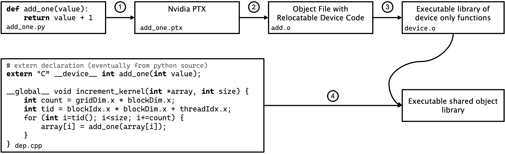
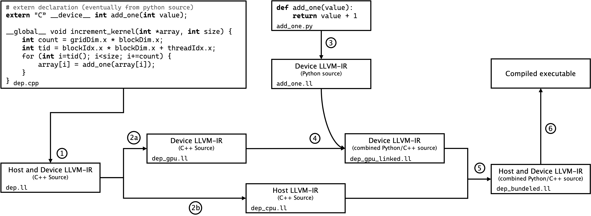

.. _gpu:

=================
GPU Functionality
=================

GPU Compilation
---------------

When targeting GPUs, MC/DC functions are just-in-time (JIT) compiled with Harmonize.
To JIT compile and execute on AMD or Nvidia GPUs, MC/DC users need only to append their terminal launches with a ``--target=gpu`` option.
When considered in totality the MC/DC+Numba+Harmonize JIT compilation structure is akin to "portability framework", in that it allows dynamic targeting and developer abstraction of hardware architectures, like OpenMP target-offloading used by OpenMC.
This JIT compilation process allows MC/DC to pair the idea of a portability framework with a high-level language in an effort to enable more rapid methods development on Exascale systems.

Monte Carlo transport functions from MC/DC are treated as device functions with global, host, and additional device functions coming from Harmonize.
Mixing codes from various sources (Python and C++) requires the user to provide an *exacting* set of compiler options to achieve an operable executable.
We provide in-depth descriptions of these sets of commands as we found the definition of this JIT compilation process one of the most difficult parts to get the MC/DC+Harmonize software engineering structure operable.

To examine the compilation strategy in-depth, a simple proxy problem is provided in Figures figcodenvcc and figcodeclang.
The figures show a simple Python function that does integer addition on a provided value (representing MC/DC transport operations) and a C++ snippet (representing Harmonize) showing first the declaration of an extern device function (eventually coming from Python) and a global function which will act as the GPU runtime for our Python device function.
Note that for the operability of these examples, extra functions are required in ``dep.cpp`` and ``add_one.py`` but are truncated for brevity.

--------------
Nvidia Targets
--------------

To compile to Nvidia GPU hardware-targets at runtime, we rely entirely on the Nvidia C-Compiler (`nvcc`).
Current versions of Numba come with CUDA operability natively, but this is set to be deprecated in future releases in favor of a more modular approach where the Numba-CUDA package will be an optional separate feature.

Simple proxy example describing how to compile device functions in Numba-Python with external C++ code for targeting Nvidia GPUs. In this simplified proxy, the Python function corresponds to MC/DC, and the C++ code corresponds to Harmonize

We begin by

#. Compiling Python device code to Nvidia PTX by ``numba.cuda.compile_ptx_for_current_device`` (which requires typed function signatures), then place that output into ``add`_one.ptx` file; next
#. Compiling PTX to relocatable device code using ``nvcc -rdc=true -dc -arch=<arch> --cudart shared --compiler-options -fPIC add.ptx -o add.o`` where ``-dc`` asks the compiler for device code, ``-rdc`` asks to make that device code relocatable, ``--cudart shared`` asks for shared CUDA runtime libraries and ``-fPIC`` generates position-independent code;
#. Compiling that relocatable byte code into a library of executable device functions is done with ``nvcc -dlink add.o -arch=<arch> --cudart shared -o device.o --compiler-options -fPIC`` where ``-dlink`` asks the compiler for relocatable device code; and finally
#. Compiling the C-CUDA file containing the global function and linking with the library of device functions originating from Python with ``nvcc -shared add.o device.o -arch=<arch> --cudart shared``.
    

While the complexity of the functions both from MC/DC (Python) and Harmonize (C++) increases dramatically when moving toward implementation in MC/DC, this compilation strategy remains mostly the same.
The exact compilation commands Harmonize calls when compiling MC/DC functions can be viewed by setting ``VERBOSE=True`` in ``harmonize/python/config.py``.
This compilation strategy also allows for the extension of functions defined in the CUDA API but not in Numba-CUDA as they can come from the C-CUDA source in ``dep.cpp``.

-----------
AMD Targets
-----------

Just in time compilation and execution to AMD devices are enabled as of `MC/DC v0.11.0 <https://github.com/CEMeNT-PSAAP/MCDC/tree/v0.11.0>`_.
Significant adaptations from the process of Nvidia compilation are required to target AMD GPUs.
PTX is a proprietary Nvidia standard, so when targeting AMD GPUs, we rely on intermediate compiler representation (IR) from LLVM for an AMD GPU hardware-target (also called an LLVM target triple).
AMD's compiler toolchain is based in the LLVM-Clang ecosystem, so we will be calling LLVM-Clang-based tools (e.g., ``hipcc`` is a wrapper function for ``clang``).
Note that while the LLVM-Clang commands are generic, AMD variations of compilers, linkers, etc. must be invoked.
For example, to invoke the correct Clang compiler point to the ROCm installed variation (often on LinuxOS at ``opt/rocm/llvm/bin/clang``).

To generate AMD target LLVM-IR from Python script, a `patch to Numba is provided by AMD <https://github.com/ROCm/numba-hip>`_.
This patch can also execute produced functions from the Python interpreter, much like Numba-CUDA.
As this patch is a port of AMD's Heterogeneous-computing Interface for Portability (HIP) API, it attempts to be a one-to-one implementation of operations implemented in Numba-CUDA.
The Numba-HIP development team has gone as far as to provide a ``numba.hip.pose_as_cuda()`` function, which, after being called in Python script, will alias all supported Numba-CUDA functions to Numba-HIP ones and compile/run automatically.

When moving to compile and execute full MC/DC+Harmonize, we must again enable the compilation of device functions from Numba-HIP and device, global, and host functions from C++.
To show that process, we again explore a simple proxy application shown in figure fig:codeclang where a Numba-HIP function adds one to an integer value and a C++ function declares an extern function by the same name and runs that function for all values of an array.

Every GPU program is technically a bound set of two complementary applications: one that runs on the host side (CPU) and the other on the device side (GPU), with global functions linking them together.
To link external device code together for AMD hardware-targets, we have to unbundle these two programs, link the extra device functions (coming from Python) to the device side, then re-bundle the device and host functions back together.
This process is done in LLVM-IR.

Simple proxy example describing how to compile device functions in Numba-HIP with external C++ code to AMD GPU targets. In this simplified proxy, the Python function corresponds to MC/DC, and the C++ code corresponds to Harmonize

Figure fig:codeclang shows the compilation structure.
We begin compilation by

#. Compiling C++ source in ``dep.cpp`` to LLVM-IR with host and device code bundled together with ``hipcc -c -fgpu-rdc -S -emit-llvm -o dep.ll -x hip dep.cpp -g`` where ``-fgpu-rdc`` asks the compiler for relocatable device code ``-emit-llvm`` requests the LLVM-IR, ``-c`` only runs preprocess, compile, and assemble steps, and ``-x hip`` specifies that ``dep.cpp`` is HIP code; 
#. Unbundling the LLVM-IR:
    
 a. first the device half ``clang-offload-bundler --type=ll --unbundle --input=dep.ll --output=dep_gpu.ll --targets=hip-amdgcn-amd-amdhsa--gfx90a`` where ``amdgcn-amd-amdhsa`` is the LLVM target-tipple and ``gfx90a`` is compiler designation for an MI250X
 b. then the host half ``clang-offload-bundler --type=ll --unbundle --input=dep.ll --output=dep_cpu.ll --targets=host-x86_64-unknown-linux-gnu``; then

#. Compiling device functions from Python source with ``numba.hip.generate_llvmir()`` and place into ``add_one.ll``;
#. Linking the now unbundled device code in ``dep_gpu.ll`` and the device code from Python in ``add_one.ll`` together with ``llvm-link dep_gpu.ll add_one.ll -S -o dep_gpu_linked.ll``; 
#. Rebundling the now combined Python/C++ device LLVM-IR back to the host LLVM-IR with ``clang-offload-bundler --type=ll --input=dep_gpu_linked.ll --input=dep_cpu.ll --output=dep_bundled.ll --targets=hip-amdgcn-amd-amdhsa--gfx90a, host-x86_64-unknown-linux-gnu``; and finally
#. Compiling to an executable with ``hipcc -v -fgpu-rdc --hip-link dep_bundled.ll-o program`` where ``--hip-link`` links clang-offload-bundles for HIP

As in the Nvidia compilation, non-implemented functions can be brought into the final program via the C++ source.
This was required for MC/DC on AMD GPUs as vector operable atomics are not currently implemented in the Numba HIP port and thus must come from the C++ side.
We hope that these more generic adaptations (relying on LLVM-Clang infrastructure instead of CUDA) will allow for greater extensibility as we move to target future accelerator platforms---namely, Intel GPUs.
For compilation to Nvidia hardware-targets, we will still keep the PTX-based compilation structure.