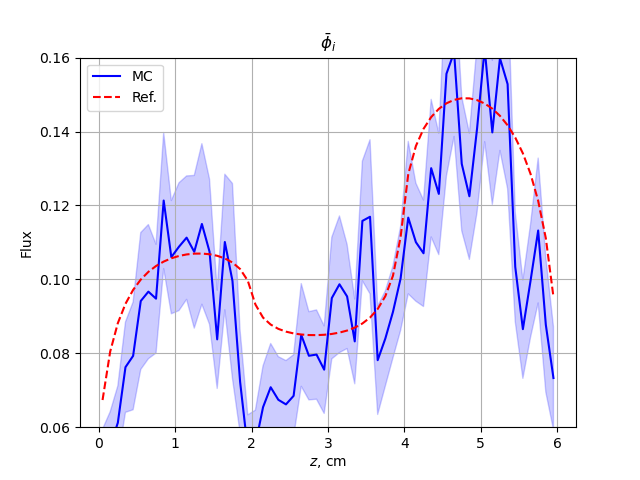
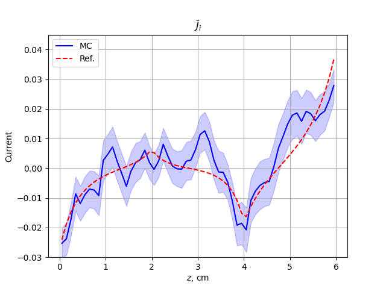
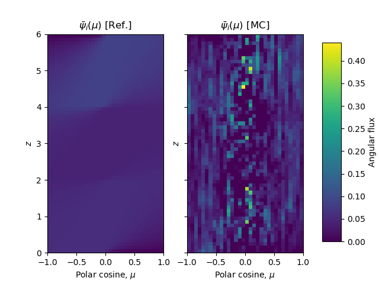
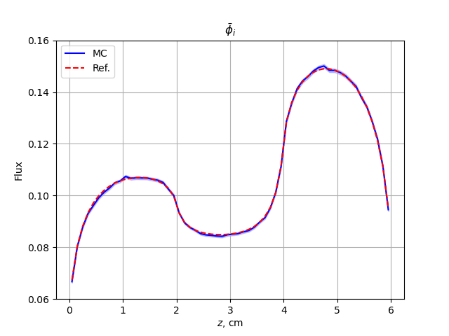
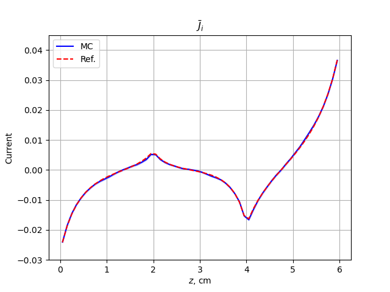
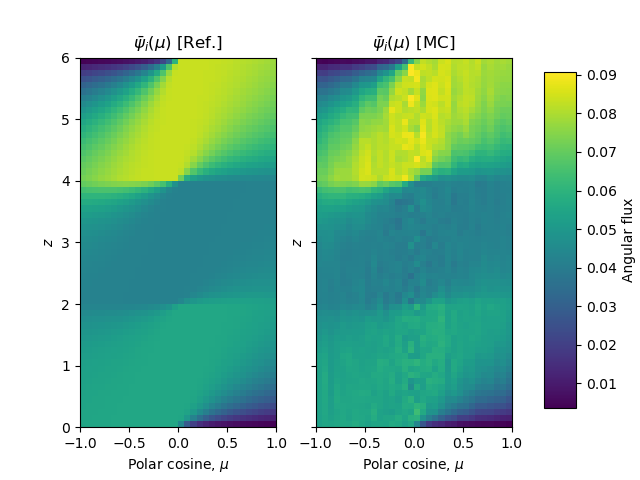

.. _user:

============
User's Guide
============

This guide presupposes you are familiar with modeling nuclear systems using a Monte Carlo method.
If you are completely new, we suggest checking out `OpenMC's theory guide <https://docs.openmc.org/en/stable/methods/introduction.htmll>`_ as most the basic underlying algorithms and core concepts are the same.
Our input decks and keyword phrases are designed so that if you are familiar with tools like OpenMC or MCNP, you should be able to get up and running quickly.

While this guide is a great place to start, the  next best place to look when getting started are our ``MCDC/examples`` or ``MCDC/testing`` directories.
Run a few problems there, change a few inputs around, and keep looking around until you get the general hang of what we are doing.
Believe it or not, there is a method to all this madness.
If you find yourself with errors you really don't know what to do with, take look at our `GitHub issues page <https://github.com/CEMeNT-PSAAP/MCDC/issues>`_.
If it looks like you are the first to have a given problem feel free to submit a new ticket!

A note on testing:
Just because something seems right doesn't mean it is.
Care must be taken to ensure that you are running the problem you think you are.
The software only knows what you tell it.

MC/DC Workflow
--------------

MC/DC uses an ``input`` -> ``run`` -> ``post-process`` workflow, where users

#. build input decks using scripts that import ``mcdc`` as a package and call functions to build geometries, tally meshes, and set other simulation parameters,
#. define a runtime sequence in the terminal to execute the ``input`` script (terminal operations are required for MPI calls),
#. export the results from ``.h5`` files and use the MC/DC visualizer or tools like ``matplotlib`` to view results.

Building an Input Script
------------------------

Building an input deck can be a complicated and nuanced process. Depending on the type of simulation you need to build, you could end up touching most of the functions in MC/DC, or very few.
Again, the best way to start building input decks is to look at what we have already done in the ``MCDC/examples`` or ``MCDC/testing`` directories.
To see more on the available input functions, look through the :doc:`pythonapi/index` section.

As an example, we walk through building the input for the ``MCDC/examples/fixed_source/slab_absorbium`` problem, which simulates a three-region, purely absorbing, mono-energetic transient slab wall.

We start with our imports:

.. code-block:: python3

    import numpy as np

    import mcdc

You may require more packages depending on the methods you are constructing, but most of what you need will be in these two.
Now, we define the materials for the problem:

.. code-block:: python3

    # Set materials
    m1 = mcdc.material(capture=np.array([1.0]))
    m2 = mcdc.material(capture=np.array([1.5]))
    m3 = mcdc.material(capture=np.array([2.0]))

In this problem we only have mono-energetic capture, but MC/DC has support for multi-group (capture, scatter, fission) and continuous energy (capture, scatter, fission).
Multi-group data is written in a single numpy array; for example, a 3-group capture cross section would be ``capture=np.array([1.0, 1.1, 0.8])``.

If you are a member of CEMeNT, we have internal repositories containing the data required for continuous-energy simulation.
Unfortunately due to export controls we can not publicly distribute this data.
If you are looking for cross-section data to plug into MC/DC, we recommend you look at OpenMC or `NJOY <http://www.njoy21.io/>`_.

After setting material data, we define the problem space by setting up surfaces with their boundary conditions (bc).
If no boundary condition is defined, the surface is assumed to be internal.

.. code-block:: python3

    # Set surfaces
    s1 = mcdc.surface("plane-z", z=0.0, bc="vacuum")
    s2 = mcdc.surface("plane-z", z=2.0)
    s3 = mcdc.surface("plane-z", z=4.0)
    s4 = mcdc.surface("plane-z", z=6.0, bc="vacuum")

Remember that the radiation transport equation is a 7-dimensional integro-differential equation,
so it's possible your problem will need both initial and boundary conditions.
While we have tried to include warnings and errors if an ill-posed problem is detected,
we cannot forecast all the ways in which things might go haywire.
For transient simulations, initial conditions are assumed to be 0 everywhere.

We create problem geometry using cells, which are defined by the surfaces that constrain them and the material that fills them.
The ``+/-`` convention is used to indicate whether the cell volume is outside (+) or inside (-) a given surface.
For example, below, the first cell is filled with material m2 and is positive with respect to s1, negative with respect to s2.
This corresponds to being bound on the left by s1 and on the right by s2.

.. code-block:: python3

    mcdc.cell([+s1, -s2], m2)
    mcdc.cell([+s2, -s3], m3)
    mcdc.cell([+s3, -s4], m1)

We define a uniform isotropic source throughout the domain:

.. code-block:: python3

    mcdc.source(z=[0.0, 6.0], isotropic=True)

Next we set tallies and specify the specific parameters of interest. Here, we're interested in the time- and space-averaged flux
and current. We set up two meshes on which to tally, using Numpy arrays: along the z-axis from 0.0 to 6.0, and along the mu axis between -1 and 1.
Regardless of problem specifics, particles are simulated through all space, direction, and time;
the tally definitions are used to indicate in which dimensions a record of particle behavior should be kept.

.. code-block:: python3

    # Tally: cell-average fluxes and currents
    mcdc.tally(
        scores=["flux", "current"],
        z=np.linspace(0.0, 6.0, 61),
        mu=np.linspace(-1.0, 1.0, 32 + 1),
    )

Next we set simulation settings. The only required setting is the number of particles.
Additional settings include, for example, the cycles to use for a k-eigenvalue problem
or whether the MC/DC title should be disabled.

.. code-block:: python3

    mcdc.setting(N_particle=1e3)

Finally, execute the problem.

.. code-block:: python3

    mcdc.run()

Put together, our example ``input.py`` file:

.. code-block:: python3

    import numpy as np
    import mcdc

    # =============================================================================
    # Set model
    # =============================================================================
    # Three slab layers with different purely-absorbing materials

    # Set materials
    m1 = mcdc.material(capture=np.array([1.0]))
    m2 = mcdc.material(capture=np.array([1.5]))
    m3 = mcdc.material(capture=np.array([2.0]))

    # Set surfaces
    s1 = mcdc.surface("plane-z", z=0.0, bc="vacuum")
    s2 = mcdc.surface("plane-z", z=2.0)
    s3 = mcdc.surface("plane-z", z=4.0)
    s4 = mcdc.surface("plane-z", z=6.0, bc="vacuum")

    # Set cells
    mcdc.cell([+s1, -s2], m2)
    mcdc.cell([+s2, -s3], m3)
    mcdc.cell([+s3, -s4], m1)

    # =============================================================================
    # Set source
    # =============================================================================
    # Uniform isotropic source throughout the domain

    mcdc.source(z=[0.0, 6.0], isotropic=True)

    # =============================================================================
    # Set tally, setting, and run mcdc
    # =============================================================================

    # Tally: cell-average fluxes and currents
    mcdc.tally(
        scores=["flux", "current"],
        z=np.linspace(0.0, 6.0, 61),
        mu=np.linspace(-1.0, 1.0, 32 + 1),
    )

    # Setting
    mcdc.setting(N_particle=1e3)

    # Run
    mcdc.run()

Now that we have a script to run, how do we actually run it?

Running a Simulation
--------------------

Executing MC/DC in something like a jupyter note book is possible but not recommended,
especially when using MPI and/or Numba.
The instructions below assume you have an existing MC/DC installation.
MPI can be quite tricky to configure if on an HPC; if you're having trouble,
consult our :ref:`install`, your HPC admin, or our `GitHub issues page <https://github.com/CEMeNT-PSAAP/MCDC/issues>`_.

Pure Python Mode
^^^^^^^^^^^^^^^^

To run in pure Python mode (slower, no acceleration)

.. code-block:: python3

    python input.py

Numba Mode
^^^^^^^^^^

.. code-block:: python3

    python input.py --mode=numba

When running in Numba mode a significant amount of time is taken compiling Python functions to performant binaries.
Only functions used in a specific simulation will be compiled.
These binaries will be cached meaning that in subsequent runs of the same simulation the compilation step can be avoided.
The cache can be used as an effective ahead of time compilation scheme where binaries can be compiled once and shared between machines.
For more information on caching see :ref:`Caching` and `Numba Caching <https://numba.readthedocs.io/en/stable/developer/caching.html>`_.

MC/DC also has the ability to run Numba in a debugging mode.
This will result in less performant code and longer compile times but will allow for better error messages from Numba and other packages.

.. code-block:: python3

    python input.py --mode=numba_debug

For more information on the exact behavior of this option see :ref:`Debugging`

Using MPI
^^^^^^^^^

MC/DC can be executed using MPI with or without Numba acceleration.
If ``numba-mode`` is enabled the ``jit`` compilation, which is executed on all threads, can take between 30s-2min.
For smaller problems, Numba compilation time could exceed runtime, and pure python mode could be preferable.
Below, ``--mode`` can equal python or numba. MC/DC gets MPI functionality via `mpi4py <https://mpi4py.readthedocs.io/en/stable/>`_. 
As an example, to run on 36 processes in Numba mode with `SLURM <https://slurm.schedmd.com/documentation.html>`_:

.. code-block:: python3

    srun -n 36 python input.py --mode=<python/numba>

For systems that do not use SLURM (i.e., a local system) try ``mpiexec`` or ``mpirun`` in its stead.

Postprocessing Results
----------------------

While the entire workflow of running and post-processing MC/DC could be done in one script,
unless the problem is very small (or you're an expert),
we recommend using separate simulation and post-processing/visualization scripts.

When a problem is executed tallied results are compiled, compressed, and saved in ``.h5`` files.
The size of these files can vary widely depending on your tally settings, 
the geometric size of the problem (e.g. number of surfaces), and the number of particles tracked.
Expect sizes as small as ``kB`` or as large as ``TB``.

These result files can be exported, manipulated, and visualized.
Data can be pulled from an ``.h5`` file using something like,

.. code-block:: python3

    import h5py
    import numpy as np
    # Load results
    with h5py.File("output.h5", "r") as f:
        z = f["tally/grid/z"][:]
        dz = z[1:] - z[:-1]
        z_mid = 0.5 * (z[:-1] + z[1:])

        mu = f["tally/grid/mu"][:]
        dmu = mu[1:] - mu[:-1]
        mu_mid = 0.5 * (mu[:-1] + mu[1:])

        psi = f["tally/flux/mean"][:]
        psi_sd = f["tally/flux/sdev"][:]
        J = f["tally/current/mean"][:, 2]
        J_sd = f["tally/current/sdev"][:, 2]  

While there can be some nuance to the dimensions of these data arrays, the folder structures should be evident from your tally settings.
You can see the structure of the file layer-by-layer using the ``keys`` attribute of an h5 group.
For example, ``f.keys()`` will return

.. code-block:: bash

    <KeysViewHDF5 ['input_deck', 'runtime', 'tally']>

and ``f['tally'].keys()`` will return

.. code-block:: bash

    <KeysViewHDF5 ['current', 'flux', 'grid']>

If needed, you can look around a ``.h5`` file using something like `h5Viewer <https://www.hdfgroup.org/downloads/>`_ (which on linux can be installed with ``sudo apt-get install hdfview``).
Otherwise these arrays can then be manipulated and modified like any other.
Results are stored as NumPy arrays, so any tool that works with NumPy arrays (*e.g.*, SciPy and Pandas)
can be used to analyze the data from your simulations.

A tool like ``matplotlib`` will work great for plotting results.
For more complex simulations, open source professional visualization software like
`Paraview <https://www.paraview.org/>`_  or `Visit <https://sd.llnl.gov/simulation/computer-codes/visit>`_ are available.

As the problem we ran above is pretty simple and has no scattering or fission, we have an `analytic solution we can import <https://github.com/CEMeNT-PSAAP/MCDC/blob/main/examples/fixed_source/slab_absorbium/reference.py>`_:

.. code-block:: python3

    from reference import reference

In the script below, we plot the space-averaged flux and space-averaged current, including their statistical noise.
We also use the space-averaged flux and current to compute a new quantity, the space-averaged angular flux, and
plot it over space and angle in a heat map.
Remember that when reporting results from a Monte Carlo solver, you should **always include the statistical error!**

.. code-block:: python3

    import matplotlib.pyplot as plt
    import numpy as np

    I = len(z) - 1
    N = len(mu) - 1

    # Scalar flux
    phi = np.zeros(I)
    phi_sd = np.zeros(I)
    for i in range(I):
        phi[i] += np.sum(psi[i, :])
        phi_sd[i] += np.linalg.norm(psi_sd[i, :])

    # Normalize
    phi /= dz
    phi_sd /= dz
    J /= dz
    J_sd /= dz
    for n in range(N):
        psi[:, n] = psi[:, n] / dz / dmu[n]
        psi_sd[:, n] = psi_sd[:, n] / dz / dmu[n]

    # Reference solution
    phi_ref, J_ref, psi_ref = reference(z, mu)

    # Flux - spatial average
    plt.plot(z_mid, phi, "-b", label="MC")
    plt.fill_between(z_mid, phi - phi_sd, phi + phi_sd, alpha=0.2, color="b")
    plt.plot(z_mid, phi_ref, "--r", label="Ref.")
    plt.xlabel(r"$z$, cm")
    plt.ylabel("Flux")
    plt.ylim([0.06, 0.16])
    plt.grid()
    plt.legend()
    plt.title(r"$\bar{\phi}_i$")
    plt.show()

    # Current - spatial average
    plt.plot(z_mid, J, "-b", label="MC")
    plt.fill_between(z_mid, J - J_sd, J + J_sd, alpha=0.2, color="b")
    plt.plot(z_mid, J_ref, "--r", label="Ref.")
    plt.xlabel(r"$z$, cm")
    plt.ylabel("Current")
    plt.ylim([-0.03, 0.045])
    plt.grid()
    plt.legend()
    plt.title(r"$\bar{J}_i$")
    plt.show()

    # Angular flux - spatial average
    vmin = min(np.min(psi_ref), np.min(psi))
    vmax = max(np.max(psi_ref), np.max(psi))
    fig, ax = plt.subplots(1, 2, sharey=True)
    Z, MU = np.meshgrid(z_mid, mu_mid)
    im = ax[0].pcolormesh(MU.T, Z.T, psi_ref, vmin=vmin, vmax=vmax)
    ax[0].set_xlabel(r"Polar cosine, $\mu$")
    ax[0].set_ylabel(r"$z$")
    ax[0].set_title(r"\psi")
    ax[0].set_title(r"$\bar{\psi}_i(\mu)$ [Ref.]")
    ax[1].pcolormesh(MU.T, Z.T, psi, vmin=vmin, vmax=vmax)
    ax[1].set_xlabel(r"Polar cosine, $\mu$")
    ax[1].set_ylabel(r"$z$")
    ax[1].set_title(r"$\bar{\psi}_i(\mu)$ [MC]")
    fig.subplots_adjust(right=0.8)
    cbar_ax = fig.add_axes([0.85, 0.15, 0.05, 0.7])
    cbar = fig.colorbar(im, cax=cbar_ax)
    cbar.set_label("Angular flux")
    plt.show()

While this script does look rather long, most of these commands are controlling things like axis labels and whatnot.
But at the end we have something like this.

Notice how noisy these solutions are? We only ran 1e3 particles.
We need more particles to get a less statistically noisy, more converged solution.
Here's results from the same simulation run with 1e6 particles:

This is much better converged around the analytic solution.
As with everything else, the best way to see what you can do is sniff around the examples.
We have examples with animated solutions, subplots, moving regions and more!

-------------------------------------
MC/DC's built in model ``visualizer``
-------------------------------------
